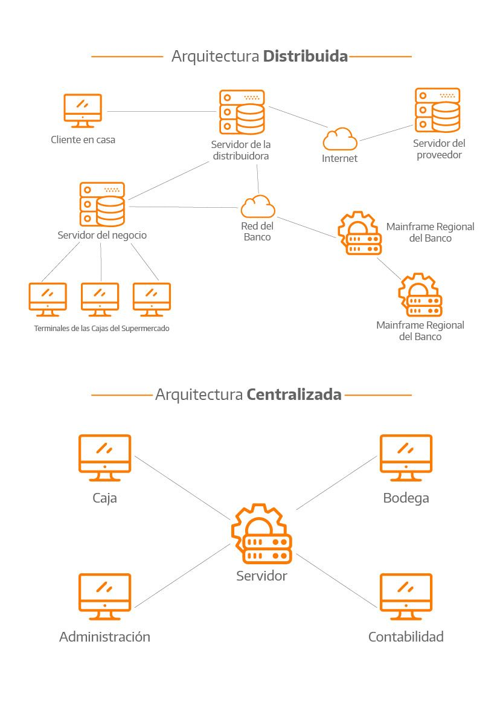
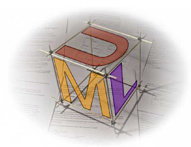
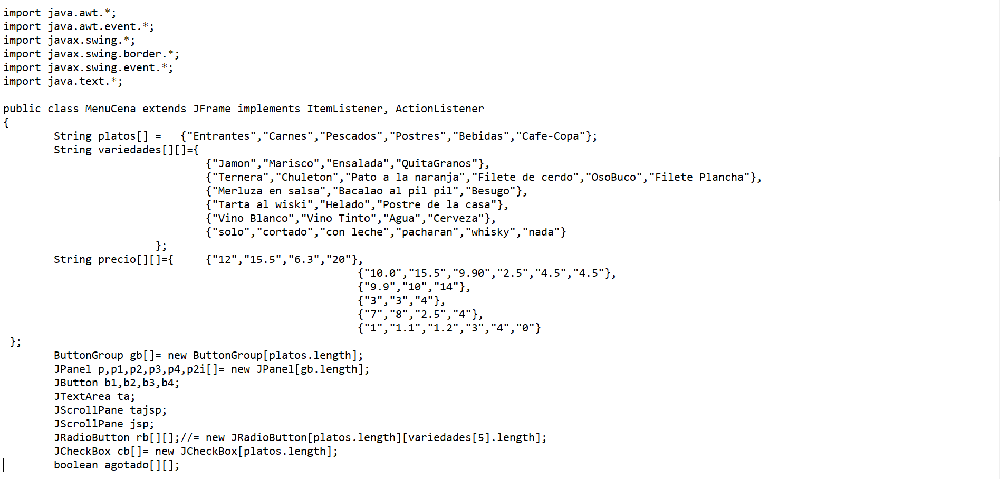
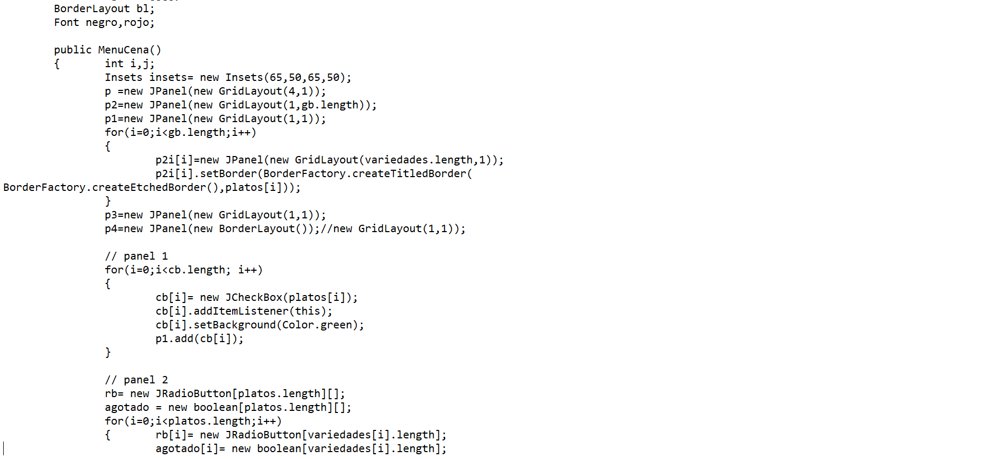
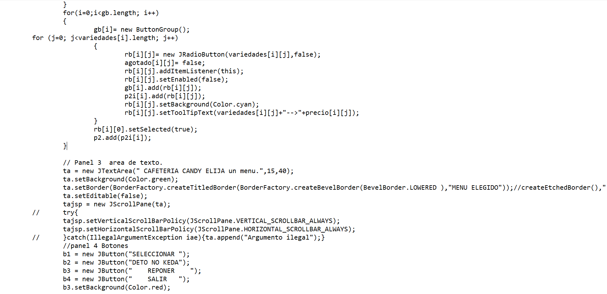
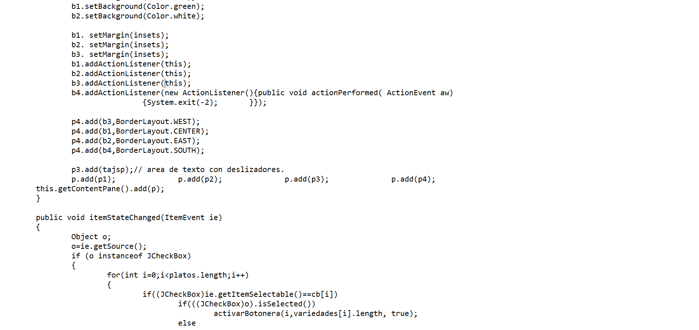
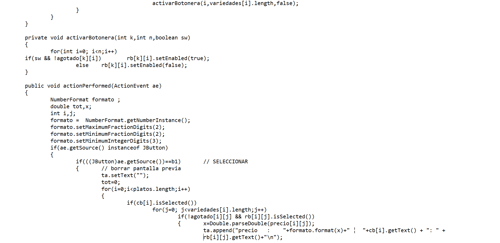
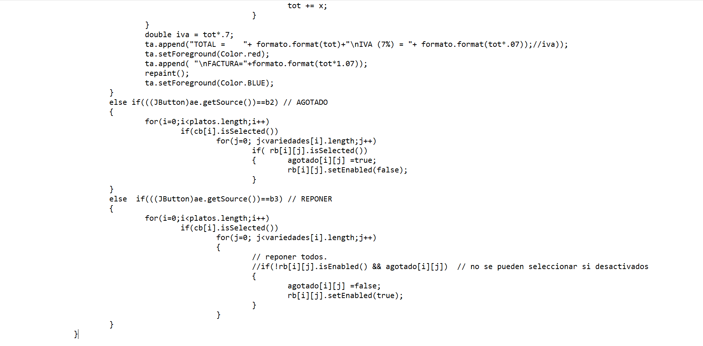
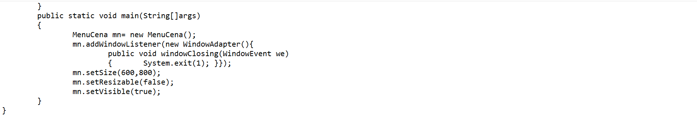
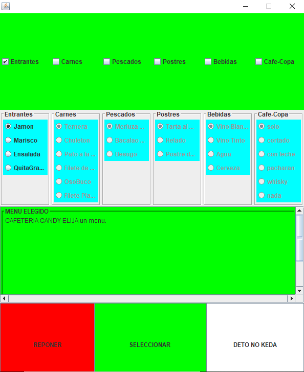

<HTML>

<h1>
Gabriel Mendoza Garcia
</h1>

<h2> Datos Principales: </h2>
<h3> Estudios: Ing. En Sistemas de Computo </h3>
<h3> Puesto Actual </h3>
<ul><li>Administrador de Base de Datos</li></ul> 
<h3> Experiencia Laboral: </h3>

<ul> 
<li>Detectar, solucionar problemas y documentar fallas del software y hardware.</li>
<li>Proveer soporte en el manejo de programas/aplicaciones.</li>
<li>Proveer ayuda al usuario de la mejor manera, para que use los recursos de computación disponibles.</li>
<li>Proveer soporte básico para el equipo de hardware.</li>
<li>Ayuda a actualizar el inventario del hardware y software.</li>
<li>Desarrollar y mantener correctamente la documentación y mapas de la red.</li>
<li>Buenas habilidades de organización; establecer prioridades realistas y conocer las fechas límites; capaz de realizar varias tareas a la vez; entrega de trabajaos de calidad.
</li> 
</ul> 

 
 

<h3> Indice </h3>
<A href="#Diario">Diario de campo</A>
 <A href="#Documentos">Documentos</A>
 <A href="#Reproducciones">Reproducciones</A>
 <A href="#Desarrollo">Desarrollo de una Solución Java OO</A>
 <A href="#Reflexiones">Reflexiones y autoevaluación</A>
 
 

<A name="Diario"><h3> Diario de campo: </h3> </A>
Objetivo personal:
Superarme en todos los aspectos de mi vida, brindando lo mejor de mí cada día, 
tanto en el aspecto laboral como en el aspecto personal.

Reflexiones: 

Aplicacion distribuida es una aplicación con distintos componentes 
que se ejecutan en entornos separados, normalmente en diferentes plataformas 
conectadas a través de una red. 

Las típicas aplicaciones distribuidas son de dos niveles (cliente-servidor), 
tres niveles (cliente-middleware-servidor) y multinivel.

Criterios de evaluación propios. 
Consideraria que mi desempeño fue bueno durante 
el tiempo que duro la clase, soy capas y dedicado al realizar las actividades 
y foros. Presente problemas por lo tiempos ya que en muchas ocasiones tuve que 
trabajar mas del horario por temas de cierre de proyectos.

<A name="Documentos"><h3> Documentos: </h3> </A>

Coloco los entregables realizados durante la clase.
 

 
<b>Entregable 1</b>
 

 
<b>Entregable 2</b>

<A name="Reproducciones"><h3> Reproducciones:</h3> </A>

Referencias sobre Aplicaciones distribuidas:

 

 
<b>Link UML</b>
 

 
<b>Platica APP Distribuidas</b>
 

<A name="Desarrollo"><h3> Desarrollo de una Solución Java OO: </h3> </A>

Anexo codigo, se creo en netbeans swing.

Basicamente lo que realiza la aplicacion es mostrar un menu para seleccionar la cena de una persona.

 
 

 

 

 

 

 

 

 
Imagen de la aplicacion
 

 

<A name="Reflexiones"><h3> Reflexiones y autoevaluación:</h3> </A>incluye a manera de ensayo las reflexiones y
autoevaluación de tu proceso de aprendizaje en la materia, dando
respuesta a las siguientes 15 cuestiones:
 
  ¿Qué aprendiste?

Aprendi los tipos de Aplicaciones distribuidas, asi como reafirmar el conocimiento de progracion y UML

  ¿Qué te falta por aprender?

Mucho, creo que apesar de la experiencia en los diferentes trabajos y la escuela aun falta mucho por aprender y mejor, tal como la programacion, 
base de datos, Procesos, ingles entre muchas otras cosas.

  ¿Cómo aplicarás lo aprendido en tu vida profesional?

En la cuestio de UML ayuda a la organizacion y documentacion de procesos, para el tema de las aplicaciones distribuidas me ayudara a entender 
un poco mejor el funcionamiento

  ¿Cómo fue tu proceso personal de aprendizaje?

Mi proceso es lento, trato de leer una o dos veces los archivos que se anexan y aparte busco funtes donde pueda ver ejemplos para tratar de 
tener un mayor entendiento en los temas

  ¿Qué aprendiste de tu profesor?

  ¿Qué aprendiste de las actividades?
Aprendi a enfocarme y tomar prioridades a las actividades.
  ¿Qué aprendiste de los contenidos y recursos del curso?
Aprendi temas relacionados con las aplicaciones distribuidas, conceptos nuevos para mi que en ocasiones se me dificultaba digerir
  ¿Qué aprendiste de tus colegas?
Los foros son muy distintos de cada uno, aprendi a ver las diferentes perspectivas documentadas en los foros
  ¿Qué aprendiste de ti mismo?
Aprendi que tal vez no tengo la experiencia profesional, pero soy capaz de lo que me proponga, ya q arme una aplicacion y una web 
aunque sea sencillas en dos dias
  ¿Cómo aprovechaste los contenidos y recursos ofrecidos por el profesor? ¿Por qué?
Seran aprovechados en lo laboral y personal. Usando diagramas tipo UML para documentar actividades ya que independiente a la programacion
pueden ser utilizado para temas variados
  ¿Cómo aprovechaste la retroalimentación dada por el profesor? ¿Por qué?
La tomo bien, me agrada que se da el tiempo de leer cada uno de nuestros post para dar una retroalimentacion objetiva
  ¿Cómo aprovechaste los canales de comunicación con el profesor? ¿Por qué?
El backboar es bueno, aunque en ocasiones falla, en el tercer foro no logre ver ningun archivo ni ninguna imagen lo que me complico realizarlo
  ¿Cómo aprovechaste las actividades de aprendizaje? ¿Por qué?
Las aprovecho para aprender algo nuevo y reafirmar mis conocimientos de las demas materias
  ¿Cómo aprovechaste la comunicación con tus colegas? ¿Por qué?
la unica comunicacion fue mediante el foro dando retro a los post, la cual me parece en ocasiones mala, porque no nos llega una notificacion si alguien retroalimenta nuestro post, y creo q muchas veces no lo checamos y se queda en el olvido esa retro
  ¿Cómo mejoraría tu proceso de aprendizaje?
teniendo mas informacion del tema, dejando bibliografias para leer, documentales para ver, etc.
  ¿Cuál es tu opinión acerca del curso? 
bueno, sin embargo, creo podria mejorar
 

</HTML>
